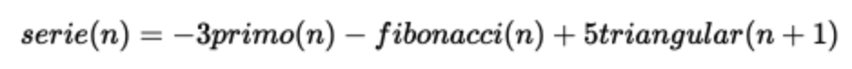

# Series numericas
Dadas las siguientes series numericas:

- https://es.wikipedia.org/wiki/N%C3%BAmero_triangular
- https://es.wikipedia.org/wiki/Sucesi%C3%B3n_de_Fibonacci
- https://es.wikipedia.org/wiki/N%C3%BAmero_primo

Desarrollar una clase con un método que entregue el término n de la serie:



Realizar pruebas unitarias al método de la serie numérica usando los 10 números naturales como entrada (10 casos de prueba en total).

Desarrollar 3 componentes de <la tecnología preferida por ti  (React, Vue, Angular)>:
 
1.- un componente visual que muestra un formulario para introducir el número n
2.- un componente no-visual donde se calcule el término n de la serie
3.- un componente visual que muestra el resultado del cálculo
 
Se espera que sean componentes distintos, integrados en una misma aplicación para evaluar el paso de información entre componentes.

Se permite utilizar JavaScript o TypeScript usando como runtime node.js o deno.js y el corredor de pruebas unitarias de tu preferencia

# About
This project is built with vue and typescript.

# Run
To run this project do a

``` shell
    git clone https://github.com/ArturoHM41234/series-numericas.git
    cd series-numericas
    npm i
    npm run dev
```


